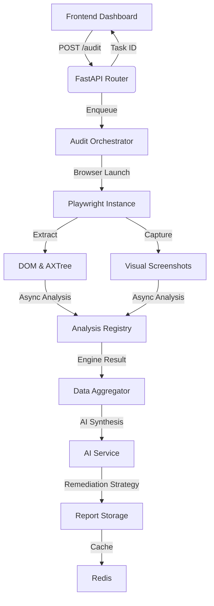

# AccessLens System Architecture

AccessLens is a high-performance accessibility auditing platform built on a modular "Collective Intelligence" architecture. It orchestrates deterministic heuristic engines with modern Vision-Language Models (VLMs) to provide contextual remediation.

---

## Technical Stack

- **Backend**: FastAPI (Python 3.10)
- **Frontend**: Next.js 14 (App Router)
- **Browser Automation**: Playwright (Headless Chromium)
- **Database**: SQLite (Local persistence)
- **Cache**: Redis (Task status & result caching)

---

## System Orchestration

The system follows an asynchronous request-response lifecycle to ensure high availability during deep audits.

---

## Analysis Engines (Modular Pipeline)

AccessLens Core utilizes a dynamic **Engine Registry** that orchestrates 7 specialized analysis layers in parallel. Each engine implements the `BaseAccessibilityEngine` interface and contributes to the final consolidated Issue Matrix.

1.  **WCAG Deterministic**: Industry-standard `axe-core` violations.
2.  **Structural Landmark**: Scans DOM for semantic landmarks, heading hierarchy, and ARIA roles.
3.  **Contrast Correlation**: Real-time computed color contrast auditing across interactive states.
4.  **Keyboard Navigation**: Simulates tab-order traversal, focus traps, and indicator visibility.
5.  **Form Validation**: Audits label associations, placeholder UX, and error-state descriptions.
6.  **UX Heuristic**: Rule-based detection of redundant link text, reading complexity, and cluttered metadata.
7.  **AI Perceptual**: Multimodal vision analysis (LLaVA) combined with context-aware code synthesis (Mistral).

---

## AI Integration Layer

Unlike traditional scanners, AccessLens uses a two-stage computer vision and code synthesis pipeline.

### 1. Vision Recognition (LLaVA)
AccessLens "sees" the UI using **LLaVA**. This engine identifies visual barriers that standard code parsers miss:
- Deceptive design patterns.
- Overlapping elements.
- Meaningful information conveyed solely through visual cues (e.g., status icons without labels).

### 2. Refactoring Synthesis (Mistral 7B)
The system uses **Mistral 7B** to translate raw violations into production-ready code. Instead of vague warnings, it provides **Synthetic Code Patches**—accurate diffs showing exactly how to refactor the offending component.

---

## Data Strategy

- **Deduplication**: The Orchestrator uses fuzzy matching to ensure that identical issues across multiple engines are unified into a single report.
- **Persistence**: Audit results and AX-Tree snapshots are stored in SQLite, while high-resolution screenshots are managed in the `storage/` directory.
- **Caching**: Global audit status is synchronized via Redis to provide real-time updates to the dashboard via polling.

---

## Evolutionary Roadmap

- **Multi-Page Crawling**: Expanding analysis from single-page snapshots to full-site recursive audits.
- **Automated PR Generation**: Directly injecting fix suggestions into CI/CD pipelines.
- **Enterprise Reporting**: PDF export and team-based compliance dashboards.

---
*Built with precision for the modern web.*
